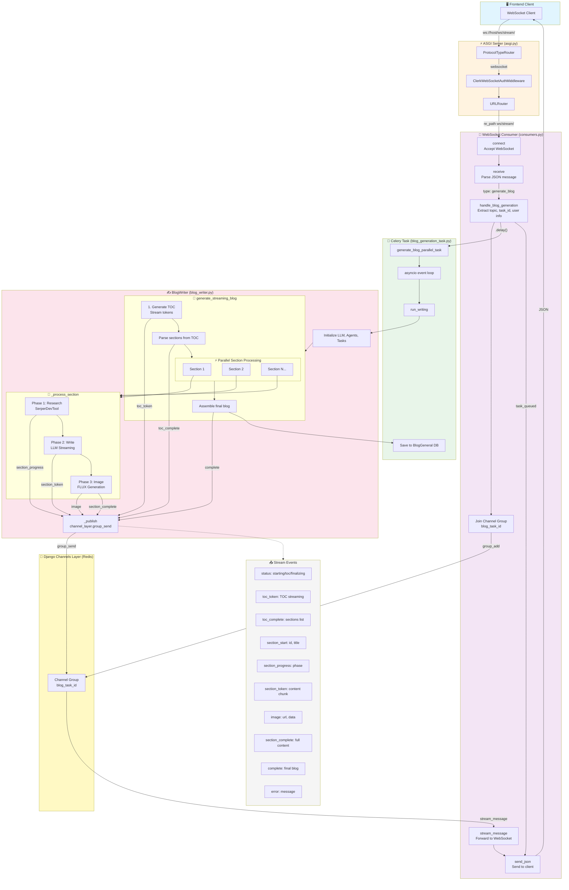

# AI Blog Generator - Django Application

This directory contains the Django web application implementation of the AI Blog Generator system. The application provides a RESTful API for generating blog posts, LinkedIn content, daily AI news, images, and comprehensive user authentication - all stored in a PostgreSQL database.

## 🚀 New: Real-Time Streaming Blog Generation

The blog generator now features a **parallel streaming architecture** that delivers content in real-time (ChatGPT-style) while processing multiple sections simultaneously:

- **⚡ True Streaming:** Words appear instantly as they are generated via WebSocket connections
- **🔄 Parallel Processing:** Multiple blog sections are researched and written concurrently using Celery workers
- **🎨 AI Images:** Context-aware images generated for each section using Flux/Fal.ai
- **💾 Auto-Save:** Completed blogs are automatically saved to PostgreSQL with full metadata
- **📊 Real-time Progress:** Live updates on section completion, token streaming, and image generation

See the [Frontend Integration Guide](FRONTEND_INTEGRATION_GUIDE.md) for details on integrating the WebSocket streaming client.

## Directory Structure

```
blog-generation-backend/
├── management_app/            # Django web application
│   ├── blog_generator/        # Blog generation app (NEW: Streaming architecture)
│   │   ├── service/
│   │   │   └── blog_writing/
│   │   │       ├── blog_writer.py      # Core parallel streaming engine
│   │   │       ├── agents/             # CrewAI agents for TOC, research, writing
│   │   │       ├── tasks/              # Agent task definitions
│   │   │       └── prompts/            # LLM prompt templates
│   │   ├── models.py          # BlogGeneral model with SEO fields
│   │   ├── serializers.py     # API serializers
│   │   └── views.py           # Blog generation endpoints
│   │
│   ├── extras/                # WebSocket consumers (NEW)
│   │   └── consumers.py       # StreamingWebSocketConsumer for real-time updates
│   │
│   ├── config/                # Main Django project settings
│   │   ├── celery/
│   │   │   └── tasks/
│   │   │       └── blog_generator_tasks/
│   │   │           └── blog_generation_task.py  # Celery task for parallel generation
│   │   ├── settings.py        # Project configuration
│   │   ├── urls.py            # Main URL routing
│   │   ├── asgi.py            # ASGI configuration for WebSockets
│   │   ├── wsgi.py            # WSGI configuration
│   │   └── celery.py          # Celery configuration
│   │
│   ├── authentication/        # User authentication application
│   │   ├── migrations/        # Authentication migration files
│   │   ├── models.py          # User model with JWT token storage
│   │   ├── serializers.py     # Authentication serializers
│   │   ├── views.py           # Authentication endpoints
│   │   └── urls.py            # Authentication routing
│   │
│   ├── manage.py              # Django management command
│   └── .env                   # Environment variables (create this file)
│
├── blog_streaming_client.html # Test client for WebSocket streaming (NEW)
├── FRONTEND_INTEGRATION_GUIDE.md  # Next.js integration guide (NEW)
├── blog_images/               # Generated images storage
├── requirements.txt           # Python dependencies
├── Dockerfile                 # Docker configuration
├── docker-compose.yml         # Docker Compose setup
└── README.md                  # Main project documentation
```

## Database Models

The application uses PostgreSQL to store all generated content and user data:

### Authentication Models

1. **User** - Custom user model with JWT token storage
   - `username` - Unique username
   - `email` - Unique email address (used for login)
   - `password` - Encrypted password
   - `simple_login_access_token` - JWT access token for simple login
   - `simple_login_refresh_token` - JWT refresh token for simple login
   - `simple_login_token_expires_at` - Simple login token expiration
   - `google_login_access_token` - JWT access token for Google login
   - `google_login_refresh_token` - JWT refresh token for Google login
   - `google_login_token_expires_at` - Google login token expiration
   - `google_profile_id` - Google profile identifier
   - `linkedin_access_token` - LinkedIn OAuth access token
   - `linkedin_profile_id` - LinkedIn profile identifier
   - `linkedin_token_expires_at` - LinkedIn token expiration
   - `linkedin_scopes` - LinkedIn OAuth granted scopes
   - `created_at` - Account creation timestamp
   - `updated_at` - Last update timestamp

### API Models

2. **BlogGeneral** - Stores generated blog posts
   - `user_id` - User identifier
   - `username` - User's username
   - `email` - User's email
   - `topic` - Blog topic
   - `content` - Full blog content (Markdown)
   - `sample_blog_url` - Optional sample blog URL
   - `image_prompts` - Generated image prompts (JSON)
   - `prompts_count` - Number of generated prompts
   - `created_at` - Timestamp

3. **BlogAiNews** - Stores daily AI news summaries
   - `user_id` - User identifier (optional)
   - `username` - User's username
   - `email` - User's email
   - `news_date` - Date of the news
   - `country` - Country for news filtering
   - `keywords` - Keywords used for news search (JSON)
   - `summary` - Short summary
   - `content` - Full news content (Markdown)
   - `created_at` - Timestamp

4. **LinkedinPost** - Stores LinkedIn posts
   - `user_id` - User identifier
   - `username` - User's username
   - `email` - User's email
   - `topic` - Post topic
   - `content` - Full post content
   - `created_at` - Timestamp

5. **LinkedinPostingContent** - Stores posted LinkedIn content
   - `user_id` - User identifier
   - `username` - User's app username
   - `email` - User's email
   - `linkedin_profile_id` - LinkedIn profile ID
   - `linkedin_username` - LinkedIn profile username
   - `content` - Posted content
   - `post_date` - When the post was made
   - `linkedin_post_id` - LinkedIn's post ID
   - `post_status` - Status (success, failed, pending)
   - `image_urls` - Posted image URLs (JSON)
   - `images_count` - Number of images posted
   - `post_type` - Type (text or image)
   - `created_at` - Timestamp

6. **ImageGeneration** - Stores generated images
   - `user_id` - User identifier
   - `username` - User's username
   - `email` - User's email
   - `prompt` - Image generation prompt
   - `image_url` - Single image URL (backward compatibility)
   - `image_urls` - Multiple image URLs (JSON)
   - `images_count` - Number of images generated
   - `enhanced_prompts` - Enhanced prompts for each image (JSON)
   - `generation_method` - Generation method used
   - `image_style` - Style of images
   - `created_at` - Timestamp

7. **TrendingTopics** - Stores trending topics analysis
   - `keyword` - Search keyword
   - `rising_topics` - Rising related topics (JSON)
   - `top_topics` - Top related topics (JSON)
   - `created_at` - Timestamp

8. **LinkedinAnalytics** - Stores LinkedIn analytics data
   - `user_id` - User identifier
   - `username` - User's username
   - `email` - User's email
   - `linkedin_profile_id` - LinkedIn profile identifier
   - `total_followers` - Total followers count
   - `total_posts` - Total posts count
   - `posts_analytics` - Post analytics data (JSON)
   - `total_reactions` - Total reactions count
   - `total_comments` - Total comments count
   - `total_reposts` - Total reposts count
   - `total_impressions` - Total impressions count
   - `total_engagement` - Total engagement count
   - `last_updated` - Last analytics update
   - `created_at` - Timestamp

9. **SchedulePosts** - Stores scheduled LinkedIn posts
   - `user_id` - User identifier
   - `username` - User's username
   - `email` - User's email
   - `linkedin_profile_id` - LinkedIn profile ID for posting
   - `linkedin_username` - LinkedIn profile username
   - `content` - LinkedIn post content
   - `image_urls` - Optional images to post (JSON)
   - `images_count` - Number of images
   - `post_type` - Type (text or image)
   - `scheduled_datetime` - When to post
   - `user_timezone` - User's timezone
   - `status` - Status (scheduled, posted, failed, cancelled)
   - `celery_task_id` - Celery task ID for cancellation
   - `linkedin_post_id` - LinkedIn's post ID after posting
   - `posted_at` - Actual posting time
   - `error_message` - Error details if failed
   - `created_at` - Timestamp
   - `updated_at` - Last update timestamp

## Setup Instructions

### Prerequisites

- Python 3.10+
- PostgreSQL database
- Redis (for Celery background tasks)
- OpenAI API key
- SerperDev API key
- Google API key (for Google authentication)
- LinkedIn API credentials (for LinkedIn integration)

### Installation

1. Clone the repository:
```bash
git clone <repository-url>
cd blog-generation-backend
```

2. Create and activate a virtual environment:
```bash
python -m venv venv
source venv/bin/activate  # On Windows: venv\Scripts\activate
```

3. Install required dependencies:
```bash
pip install -r requirements.txt
```

4. Create a `.env` file in the project root with the following configuration:
```env
# API Keys
OPENAI_API_KEY=your_openai_api_key
SERPER_API_KEY=your_serper_api_key
GOOGLE_API_KEY=your_google_api_key

# Database Configuration
DB_ENGINE=django.db.backends.postgresql
DB_NAME=ai_blog_generation
DB_USER=postgres
DB_PASSWORD=postgres
DB_HOST=localhost
DB_PORT=5432

# Google OAuth Configuration
GOOGLE_CLIENT_ID=your_google_client_id
GOOGLE_CLIENT_SECRET=your_google_client_secret
GOOGLE_REDIRECT_URI=http://localhost:8000/auth/google/callback

# LinkedIn OAuth Configuration
LINKEDIN_CLIENT_ID=your_linkedin_client_id
LINKEDIN_CLIENT_SECRET=your_linkedin_client_secret
LINKEDIN_REDIRECT_URI=http://localhost:8000/auth/linkedin/callback

# Redis Configuration (for Celery)
REDIS_URL=redis://localhost:6379/0

# JWT Configuration
JWT_SECRET_KEY=your_jwt_secret_key
```

5. Create the PostgreSQL database:
```bash
# Using psql CLI
createdb ai_blog_generation

# Or using PostgreSQL command line
psql -U postgres
CREATE DATABASE ai_blog_generation;
\q
```

6. Navigate to the Django application directory:
```bash
cd management_app
```

7. Run database migrations:
```bash
python manage.py makemigrations
python manage.py migrate
```

8. Create a superuser (optional):
```bash
python manage.py createsuperuser
```

9. Start Redis server (for background tasks):
```bash
redis-server
```

10. Start Celery worker (in a separate terminal):

**For MacOS (Recommended to avoid fork() crashes):**
```bash
celery -A management_app.config.celery worker --loglevel=info --pool=threads --concurrency=10
```

**For Linux/Production:**
```bash
celery -A management_app.config.celery worker --loglevel=info --concurrency=4
```

> **Note:** MacOS users should use `--pool=threads` to prevent `SIGABRT` crashes caused by Objective-C runtime conflicts with process forking. The threads pool is safe and performant for local development.

11. Start Celery beat scheduler (in another separate terminal - for scheduled tasks):
```bash
celery -A management_app.config.celery beat --loglevel=info
```

12. Start Django server:
```bash
python manage.py runserver
```

13. (Optional) Test the WebSocket streaming:
- Open `blog_streaming_client.html` in your browser
- Or integrate with your Next.js frontend using the [Frontend Integration Guide](FRONTEND_INTEGRATION_GUIDE.md)

## WebSocket Streaming Architecture

The blog generator uses a real-time streaming architecture for instant content delivery:

### WebSocket Endpoint
```
ws://localhost:8000/ws/stream/
```

### Request Format
```json
{
  "type": "blog_generation",
  "message_id": "unique-uuid",
  "topic": "The Future of AI",
  "blog_type": "Guide",
  "keywords": ["AI", "technology"],
  "generate_images": true,
  "length_min": 800,
  "length_max": 1500
}
```

### Response Events

The WebSocket sends real-time events as the blog is generated:

| Event Type | Description | Payload |
|------------|-------------|---------|
| `task_queued` | Task sent to Celery worker | `{task_id, celery_task_id, message}` |
| `status` | General status update | `{message}` |
| `toc` | Table of contents generated | `{total_sections, sections: [{id, title, index}]}` |
| `section_start` | Section generation started | `{section_id, section_title}` |
| `section_token` | Real-time content token (word-by-word) | `{section_id, content}` |
| `section_progress` | Section status update | `{section_id, section_title, phase, message}` |
| `section_complete` | Section finished | `{section_id, section_title}` |
| `image` | Image generated for section | `{section_id, section_title, image_url}` |
| `complete` | Full blog generation complete | `{message, data: {content, sections, image_urls}}` |
| `error` | Error occurred | `{message}` |

### Architecture Flow

```
Frontend (WebSocket) 
    ↓
StreamingWebSocketConsumer (consumers.py)
    ↓
Celery Task Queue (Redis)
    ↓
generate_blog_parallel_task (Celery Worker)
    ↓
BlogWriter (Parallel Section Processing)
    ├─→ TOC Agent (CrewAI)
    ├─→ Research Agents (Parallel)
    ├─→ Writer Agents (Streaming via LLM.astream())
    └─→ Image Generation (Fal.ai)
    ↓
Redis Pub/Sub (Real-time updates)
    ↓
WebSocket Consumer → Frontend
    ↓
PostgreSQL (Auto-save on completion)
```


## API Endpoints

### Authentication Endpoints

- **User Registration**
  - `POST /auth/register/`
  - Request: `{"username": "user", "email": "user@example.com", "password": "password123"}`
  - Response: User data with JWT tokens

- **User Login**
  - `POST /auth/login/`
  - Request: `{"email": "user@example.com", "password": "password123"}`
  - Response: User data with JWT tokens

- **Token Refresh**
  - `POST /auth/refresh/`
  - Request: `{"refresh": "refresh_token"}`
  - Response: New access token

- **Google Authentication**
  - `GET /auth/google/login/` - Redirect to Google OAuth
  - `GET /auth/google/callback` - Google OAuth callback

- **LinkedIn Authentication**
  - `GET /auth/linkedin/login/` - Redirect to LinkedIn OAuth
  - `GET /auth/linkedin/callback` - LinkedIn OAuth callback
  - `GET /auth/linkedin/token/` - Get LinkedIn token info

- **User List**
  - `GET /auth/users/` - List all users (admin only)

### Content Generation Endpoints

1. **Blog Generation**
   - `POST /api/generate-blog/`
   - Request: `{"topic": "Blog Topic", "keywords": "optional,keywords", "sample_blog_url": "optional_url"}`
   - Response: Generated blog post content and metadata

2. **Daily AI News**
   - `POST /api/daily-ai-news/`
   - Request: `{"country": "US", "keywords": ["AI", "technology"]}`
   - Response: Generated daily AI news content

3. **LinkedIn Posts**
   - `POST /api/generate-linkedin-post/`
   - Request: `{"topic": "LinkedIn Post Topic"}`
   - Response: Generated LinkedIn post content

4. **Image Generation**
   - `POST /api/generate-image/`
   - Request: `{"prompt": "Image Description", "keywords": "optional,keywords", "images_count": 3}`
   - Response: Generated image file paths

5. **Trending Topics**
   - `POST /api/fetch-related-topics/`
   - Request: `{"keyword": "AI technology"}`
   - Response: Rising and top related topics

### LinkedIn Integration Endpoints

6. **Post on LinkedIn**
   - `POST /api/post-on-linkedin/`
   - Request: `{"content": "Post content", "image_urls": ["optional", "image", "urls"]}`
   - Response: Posted content details

7. **Validate LinkedIn Token**
   - `GET /api/validate-linkedin-token/`
   - Response: Token validation status

8. **LinkedIn Re-authentication URL**
   - `GET /api/linkedin-reauth-url/`
   - Response: LinkedIn re-authentication URL

9. **LinkedIn Analytics**
   - `GET /api/linkedin-analytics/`
   - Response: LinkedIn profile and posts analytics

### LinkedIn Scheduling Endpoints

10. **Schedule LinkedIn Post**
    - `POST /api/schedule-linkedin-post/`
    - Request: `{"content": "Post content", "scheduled_datetime": "2024-01-01T12:00:00Z", "user_timezone": "UTC"}`
    - Response: Scheduled post details

11. **Get Scheduled Posts**
    - `GET /api/scheduled-posts/`
    - Response: List of user's scheduled posts

12. **Cancel Scheduled Post**
    - `DELETE /api/cancel-scheduled-post/<schedule_id>/`
    - Response: Cancellation confirmation

## Running the Server

To start the development server:

```bash
# Navigate to the Django app directory
cd management_app

# Standard development server
python manage.py runserver

# Specify host and port
python manage.py runserver 0.0.0.0:8000
```

Access the API documentation at: http://localhost:8000/docs/

## Development Guidelines

### Adding New Endpoints

1. Define the model in `api/models.py` or `authentication/models.py`
2. Create serializers in the respective `serializers.py`
3. Implement the view in the respective `views.py`
4. Add URL patterns in the respective `urls.py`
5. Run migrations:
   ```bash
   python manage.py makemigrations
   python manage.py migrate
   ```

### Database Access

The application automatically stores generated content in the PostgreSQL database using Django's ORM. To query the data:

```python
# Example: Retrieve the latest 10 blog posts
from api.models import BlogGeneral
recent_blogs = BlogGeneral.objects.order_by('-created_at')[:10]

# Example: Get user with JWT tokens
from authentication.models import User
user = User.objects.get(email='user@example.com')
```

### Environment Configuration

The application uses python-dotenv to load environment variables. All settings in `.env` are accessible via:

```python
import os
api_key = os.environ.get('OPENAI_API_KEY')
```

### Accessing AI Tools

The Django application accesses the AI tools from the `/tools` directory. This modular approach allows:

1. Better separation of concerns between the web application and AI functionality
2. Ability to use the AI tools in other contexts outside of the Django app
3. Easier maintenance of AI-specific functionality

Example of importing tools:

```python
# In views.py
from tools.ai.blog_generator.blog_writing.blog_writer import BlogWriter
from tools.ai.linkedin_post_generator.linkedin_post_generator import LinkedInPostGenerator
from tools.ai.image_generation.image_generator import generate_image
```

## Authentication System

The application supports multiple authentication methods:

### Simple Login/Registration
- Email and password-based authentication
- JWT tokens stored in database for session management
- Automatic token refresh capability

### Google OAuth
- Google Sign-In integration
- JWT tokens generated and stored after successful OAuth
- Google profile ID stored for user identification

### LinkedIn OAuth
- LinkedIn authentication for API access
- OAuth tokens stored for LinkedIn API operations
- Separate from JWT tokens used for app authentication

## Background Tasks

The application uses Celery with Redis for background task processing:

### Scheduled LinkedIn Posts
- Posts are scheduled using Celery Beat
- Background workers handle the actual posting
- Task status tracking and error handling

### Setup Celery
1. Install and start Redis server
2. Start Celery worker: `celery -A config worker --loglevel=info`
3. Start Celery beat: `celery -A config beat --loglevel=info`

## Troubleshooting

### Database Connection Issues

If you encounter database connection problems:

1. Check PostgreSQL is running:
   ```bash
   pg_isready
   ```

2. Verify connection settings in `.env` file

3. Test connection with psql:
   ```bash
   psql -h localhost -U postgres -d ai_blog_generation
   ```

### Migration Issues

If you encounter migration problems:

```bash
# Check migration status
python manage.py showmigrations

# Reset migrations (caution: this loses all data)
python manage.py migrate api zero
python manage.py migrate authentication zero
python manage.py makemigrations api
python manage.py makemigrations authentication
python manage.py migrate
```

### Redis/Celery Issues

If background tasks aren't working:

1. Check Redis is running:
   ```bash
   redis-cli ping
   ```

2. Restart Celery workers:
   ```bash
   pkill -f "celery worker"
   celery -A config worker --loglevel=info
   ```

### ALLOWED_HOSTS Issues

If you get a "DisallowedHost" error when accessing the application:

1. Edit `config/settings.py` and add your host to the ALLOWED_HOSTS list:
   ```python
   ALLOWED_HOSTS = ['localhost', '127.0.0.1', '0.0.0.0', 'your-domain.com']
   ```

## Deployment

For production deployment:

1. Update `config/settings.py`:
   - Set `DEBUG = False`
   - Configure `ALLOWED_HOSTS`
   - Use environment variables for sensitive settings
   - Configure proper logging

2. Set up a production-ready server:
   ```bash
   pip install gunicorn
   gunicorn config.wsgi:application
   ```

3. Configure a reverse proxy (Nginx/Apache)

4. Use a proper PostgreSQL production configuration

5. Set up Redis for production

6. Configure Celery with proper process management (systemd/supervisor)

## Docker Setup

The application includes Docker support for development, staging, and production environments, making it easy to run consistently across different systems.

### Docker Directory Structure

```
blog-generation-backend/
├── Dockerfile              # Multi-stage Dockerfile for different environments
├── docker-compose.yml      # Docker Compose configuration
└── requirements.txt        # Python dependencies
```

### Prerequisites

- Docker
- Docker Compose

### Environment Setup

Before running the containers, create your `.env` file in the project root:

```bash
# Copy and edit with your actual values and API keys
cp .env.example .env
nano .env
```

### Running with Docker Compose

The application uses Docker Compose profiles to manage different environments:

#### Development Environment

```bash
# Run the development environment
docker-compose --profile development up

# Run in detached mode
docker-compose --profile development up -d
```

Features:
- Django development server
- Debug mode enabled
- Hot reloading of code changes

#### Staging Environment

```bash
# Run the staging environment
docker-compose --profile staging up
```

Features:
- Gunicorn web server
- Debug mode enabled
- Similar to production but with debugging capabilities

#### Production Environment

```bash
# Run the production environment
docker-compose --profile production up
```

Features:
- Gunicorn web server
- Debug mode disabled
- Running as non-root user for improved security
- Optimized resource limits

### Managing Docker Containers

```bash
# Stop running containers
docker-compose down

# View logs
docker-compose logs -f

# Rebuild images after changes to Dockerfile
docker-compose build [development|staging|production]
```

### Running Commands Inside Containers

```bash
# For Django management commands
docker-compose exec development python management_app/manage.py makemigrations
docker-compose exec development python management_app/manage.py migrate

# Access Django shell
docker-compose exec development python management_app/manage.py shell

# For bash access
docker-compose exec development bash
```

### Database Management with Docker

The application can use either:
- The PostgreSQL database configured in your .env file
- A dockerized PostgreSQL instance (can be added to docker-compose.yml)

### Troubleshooting Docker Issues

If you encounter issues:

1. Check container logs:
   ```bash
   docker-compose logs -f
   ```

2. Verify environment variables are correctly set in .env

3. Ensure ports are not already in use on your host machine

4. Rebuild the image if dependencies have changed:
   ```bash
   docker-compose build --no-cache [development|staging|production]
   ```


# Chat Infrastructure

